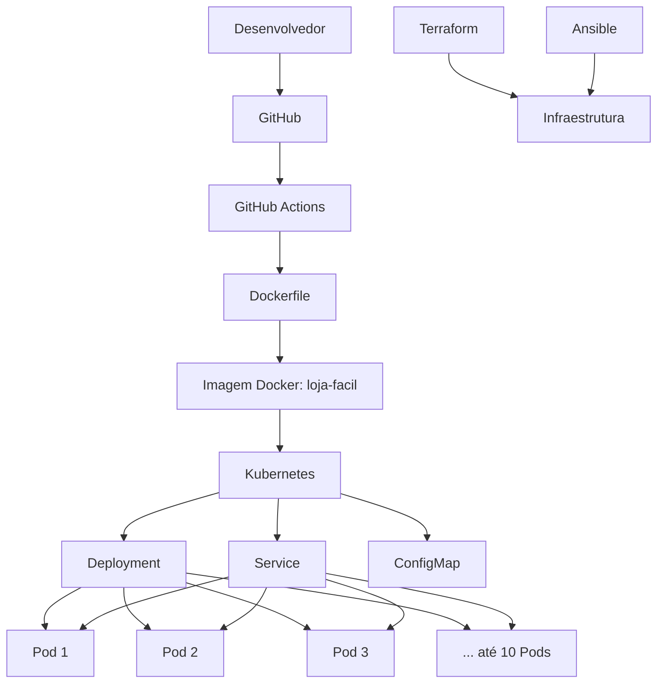

# Diagrama da Infraestrutura - Loja Fácil

```mermaid
flowchart TD
    A[Desenvolvedor] --> B[GitHub]
    B --> C[GitHub Actions]
    C --> D[Dockerfile]
    D --> E[Imagem Docker: loja-facil]

    E --> F[Kubernetes]

    F --> G[Deployment]
    F --> H[Service]
    F --> I[ConfigMap]

    G --> J[Pod 1]
    G --> K[Pod 2]
    G --> L[Pod 3]
    G --> M[... até 10 Pods]

    H --> J
    H --> K
    H --> L
    H --> M

    N[Terraform] --> O[Infraestrutura]
    P[Ansible] --> O
```
